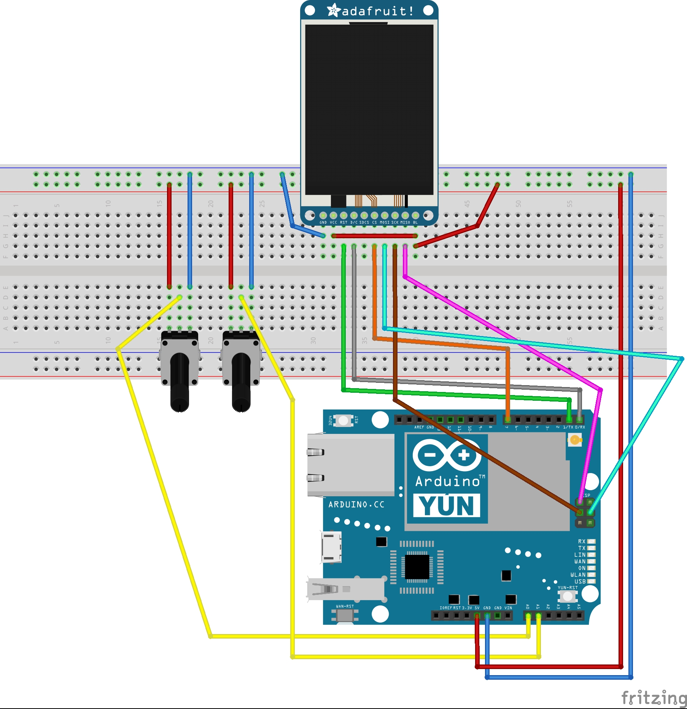
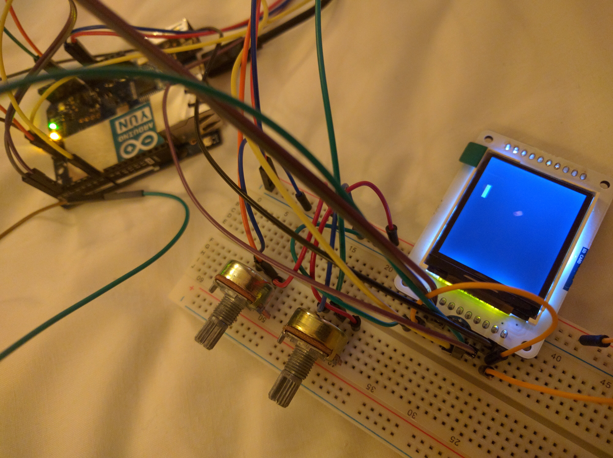

TFT PONG
======================================

**What?**

Catch a ball on a TFT display using potentiometers (A0,A1)

**Parts**

- Arduino YUN
- USB cable
- TFT display
- Breadboard
- 2 Potentiometers
- Male/Male Breadboard Jumper Cable Wires x 17
- Female/Female Breadboard Jumper Cable Wires x 3 to connect to ICSP pins

**Code**

Source code in `main` needs to be uploaded to the board.

